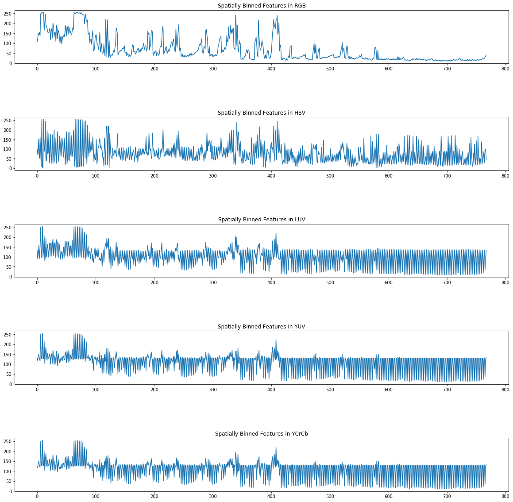
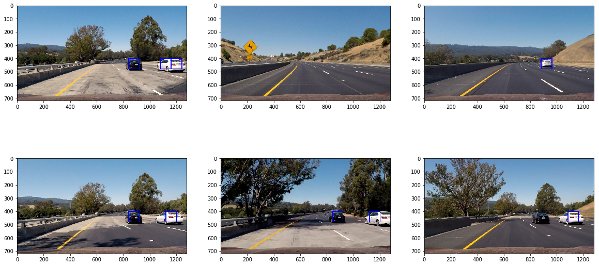

##Writeup Template
###You can use this file as a template for your writeup if you want to submit it as a markdown file, but feel free to use some other method and submit a pdf if you prefer.

---

**Vehicle Detection Project**

The goals / steps of this project are the following:

* Perform a Histogram of Oriented Gradients (HOG) feature extraction on a labeled training set of images and train a classifier Linear SVM classifier
* Optionally, you can also apply a color transform and append binned color features, as well as histograms of color, to your HOG feature vector.
* Note: for those first two steps don't forget to normalize your features and randomize a selection for training and testing.
* Implement a sliding-window technique and use your trained classifier to search for vehicles in images.
* Run your pipeline on a video stream (start with the test_video.mp4 and later implement on full project_video.mp4) and create a heat map of recurring detections frame by frame to reject outliers and follow detected vehicles.
* Estimate a bounding box for vehicles detected.

## [Rubric](https://review.udacity.com/#!/rubrics/513/view) Points
###Here I will consider the rubric points individually and describe how I addressed each point in my implementation.  

---
###Writeup / README

All code for my notebook is in `vehicle_detection.ipynb` and the final project video is in `project_video_output.mp4`

###Histogram of Oriented Gradients (HOG)

####1. Explain how (and identify where in your code) you extracted HOG features from the training images.

The code for extract HOG Features is in `#Histogram-of-Gradients` section of my ipython notebook.

I started by reading in all the `vehicle` and `non-vehicle` images.  Here is an example of one of each of the `vehicle` and `non-vehicle` classes:

Data Exploration revealed the following:
* Image Shape: (64, 64, 3)
* Number of Non Car Images: 8968
* Number of Car Images: 8792

There are slightly more non car than car images, which may be beneficial as there are fewer cars in a video frame.

To get Histogram of Gradient features I reused the `get_hog_features` function presented in the lesson. I obtained the following visualizations -

It is clear from the HOG visualization images that there are vast differences between car and non-car gradients. One noticible aspect is that car gradients are visualized as horizontal lines at the bottom and vertical lines at the top of the image

I also explored using Color Histograms and Spatial Binning and observed the following differences.

**Color Histograms(RGB) of Car**

**Color Histograms(RGB) of Non Car**

**Color Histograms(HSV) of Car**

**Color Histograms(HSV) of Non Car**

**Spatially Binned(RGB) Feature Vector of Car**

**Spatially Binned(RGB) Feature Vector of NonCar**

The RGB channel seems to give maximum information for both Color Histogram Features and Spatially Binned Features but I chose to restrict myself to only HOG Features for my Classifier.

####2. Explain how you settled on your final choice of HOG parameters.

I tried different combinations of parameters for training my classifier and obtaining my HOG Features.

This is a visualization of the final feature parameters I used and the normalized feature vectors.

I've mentioned my experimentation with HOG Features in the next section.

####3. Describe how (and identify where in your code) you trained a classifier using your selected HOG features (and color features if you used them).

The section of my notebook `#Train-Classifier` deals with the code to train a classifier.

I trained a linear SVM using the functions `feature_testing` and `classifier_helper_hog`

Experiments

In the following experiments I tried searching for parameters to the HOG function that was able to classify the car_features and non_car_features I obtained from my features with the greatest accuracy. I observed that in some cases (eg orientation/pix_per_cell/cell_per_block) higher values did not ensure greater accuracy and the colorspace and HOG channels were most beneficial in getting higher accuracy. Size of the feature vector was also an important factor.

I ended up choosing the following parameters for my classifier:

- Colorspace = YUV
- HOG Channel = "ALL"
- Orientation = 12
- pix per cell = 16
- cell per block = 2

My classifier has an accuracy of **Accuracy of 99.07 %**

###Sliding Window Search

####1. Describe how (and identify where in your code) you implemented a sliding window search.  How did you decide what scales to search and how much to overlap windows?

I used the function `find_cars` to find my sliding windows. I searched along the y-axis from (400, 656) using my pix per cell = 16 and cell per block = 2 and changed the scale of my image.

The following are some searched I did for image with -

**Sliding Window For Scale of 1.25**

**Sliding Window For Scale of 1.5**

####2. Show some examples of test images to demonstrate how your pipeline is working.  What did you do to optimize the performance of your classifier?

My final pipeline code is in `process_rectangles` (which combines the bounding boxes for the different window sizes I searched on), `process_frame` which calculates the final pipeline with the following steps.

1. Calculate the rectangles using process_rectangles for scale 1.25 and 1.5. I searched along the y-axis from (400, 656) using my pix per cell = 16 and cell per block = 2 , Colorspace = YUV, HOG Channel = "ALL"
and Orientation = 12.
2. Calculate the heatmap image using the rectangles
3. Apply a threshold of 1 for the heatmap image
4. Get Labels for the Heatmap
5. Draw the labelled bounding boxes on the final image.

For my project_video I tried using an augmented version of `process_frame_with_history` for processing the video frames where I also store the result for the last 10 frames and make use of that while calculating the results for a new frame so that the video frames appear smoother. However this strategy resulted in large number of false positives so I abandoned it and stuck to using `process_frame`

---

### Video Implementation

####1. Provide a link to your final video output.  Your pipeline should perform reasonably well on the entire project video (somewhat wobbly or unstable bounding boxes are ok as long as you are identifying the vehicles most of the time with minimal false positives.)
Here's a [link to my video result](./project_video_output.mp4)

####2. Describe how (and identify where in your code) you implemented some kind of filter for false positives and some method for combining overlapping bounding boxes.

My code for calculating the bounding box is in section #Sliding-Window of my ipython notebook.
I reused functions `find_cars`, `draw_boxes`, `add_heat`, `apply_threshold` and `draw_labeled_bboxes`.

I recorded the positions of positive detections in each frame of the video.  From the positive detections I created a heatmap and then thresholded that map to identify vehicle positions.  I then used `scipy.ndimage.measurements.label()` to identify individual blobs in the heatmap.  I then assumed each blob corresponded to a vehicle.  I constructed bounding boxes to cover the area of each blob detected

### Here are six frames and their corresponding heatmaps:

### Here the resulting bounding boxes:

---

###Discussion

####1. Briefly discuss any problems / issues you faced in your implementation of this project.  Where will your pipeline likely fail?  What could you do to make it more robust?

### Issues Faced
* HOG Feature Tuning: Tuning the HOG Features took a little practice. Highly accurate feature set that provided high classification accuracy was sometimes large and took time to calculate. A smaller feature set size with slightly low accuracy was sufficient for the classifier.

* Handling False Positives: I experimented with different scales for my pipeline and found that the higher my scale was the more chance of detecting false positives.

* Handling cars far away or appearing from the bottom of the video: My pipeline cannot classify these as car images as they may be too small or not be identified as car images. Even after setting a large region of interest it was still difficult to detect cars that were just appeaing

* Time to process video: The final project video took a long time for me to process as my feature vector size was very large (> 5000 ). I included only HOG Features and reduced the feature vector side to around 1200, ran my code on a GPU instance and the time to process drastically reduced.

### Improvements

* Adding Color Histogram: The RGB feature vector for color histograms in particular looked promising. I did not incorporate it into my pipeline but it can definitely be used to improve the accuracy of the classifier.

* Augmented Car Data: The Dataset for the car data could include cropped portions of the cars in the video and that would improve detection.

* Using Kalman Filters: This could improve object detection and tracking similar to our lane finding project.
